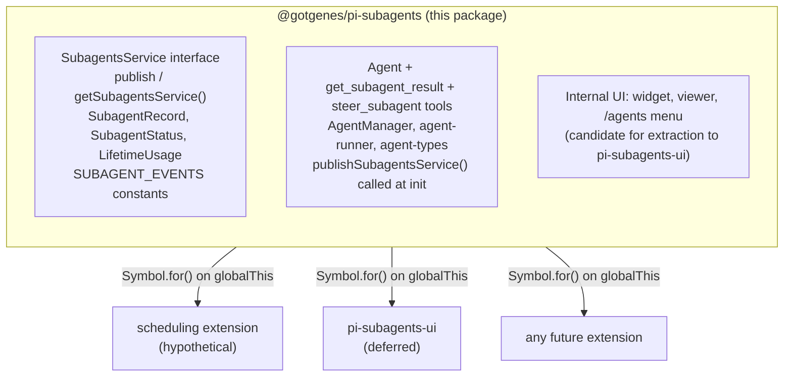

# Architecture

This document describes the architecture of the pi-subagents fork: a focused, composable core with a stable API boundary that other extensions can build on.

## Design principles

1. **Narrow core** — the extension owns agent spawning, execution, and result retrieval.
   Everything else is a consumer.
2. **Composable by default** — other extensions can spawn agents, observe their lifecycle, and display their state without importing this package directly.
3. **Typed API boundary** — this package exports a `SubagentsService` interface and `Symbol.for()` accessors (`publishSubagentsService` / `getSubagentsService`).
   Consumers declare this package as an optional peer dependency and use dynamic import for compile-time types.
   The runtime bridge is `Symbol.for("@gotgenes/pi-subagents:service")` on `globalThis` — no separate API package.
4. **No scheduling** — in-process scheduling is removed from the core.
   Scheduling is a separate concern that any extension can implement by calling `spawn()` on the published API.
5. **UI extraction is deferred** — the widget, conversation viewer, and `/agents` command menu stay in the core for now.
   They are the first candidate for extraction once the API boundary is proven stable.
6. **Snapshot, don't capture** — mutable parent state (ctx, session, model) is read once at spawn time and frozen into a `ParentSnapshot` data object.
   No live references survive past the spawn call.
7. **Subscribe, don't thread** — observation of agent progress uses direct session-event subscription, not callback parameters threaded through multiple layers.
8. **Construct complete** — objects are born with all their dependencies.
   If state isn't available yet, the object that needs it doesn't exist yet.
   No post-construction field writes from external code — if an object can't be instantiated ready-to-go, the prep work hasn't been done and the right dependencies haven't been identified.
9. **State owns its mutations** — mutable state lives in a class whose methods enforce valid transitions and invariants.
   Free functions that mutate module-scoped variables, closure-captured bags-of-functions, and external writes to shared interfaces are replaced by classes that encapsulate the state they manage.

## Current state

The extension is organized into 39 focused modules with a typed `SubagentsService` API boundary.

```text
index.ts                  — entry point, tool registration, event wiring
agent-manager.ts          — lifecycle, concurrency, queue
agent-runner.ts           — session creation, turn loop, tool filtering
session-config.ts         — pure session-config assembler
agent-types.ts            — type registry (defaults + custom .md files)
agent-record.ts           — agent record with encapsulated status transitions
types.ts                  — shared type definitions
runtime.ts                — SubagentRuntime factory (session-scoped state)
parent-snapshot.ts        — immutable snapshot of parent session state

prompts.ts                — system prompt assembly
context.ts                — parent conversation extraction
memory.ts                 — persistent MEMORY.md per agent
skill-loader.ts           — preload .pi/skills into prompts
env.ts                    — git/platform detection

worktree.ts               — git worktree isolation
usage.ts                  — token usage tracking
model-resolver.ts         — fuzzy model name resolution
invocation-config.ts      — merge tool params with agent config
session-dir.ts            — subagent session directory derivation
settings.ts               — persistent operational settings; `SettingsManager` class owns all three in-memory values

service.ts                — SubagentsService interface + Symbol.for() accessors
service-adapter.ts        — SubagentsService implementation wrapping AgentManager

tools/agent-tool.ts          — Agent tool definition, parameter validation, dispatch
tools/foreground-runner.ts   — foreground execution loop (spinner, streaming, result)
tools/background-spawner.ts  — background spawn (activity setup, notification wiring)
tools/get-result-tool.ts     — get_subagent_result tool
tools/steer-tool.ts          — steer_subagent tool
tools/helpers.ts             — shared tool utilities (textResult, buildDetails, getStatusNote, …)

handlers/lifecycle.ts     — session_start, session_before_switch, session_shutdown
handlers/tool-start.ts    — tool_execution_start handler

notification.ts           — completion nudges, custom message renderer
renderer.ts               — notification TUI component
record-observer.ts        — session-event observer for record statistics

ui/agent-widget.ts        — above-editor live status widget
ui/agent-menu.ts          — /agents slash command menu
ui/conversation-viewer.ts — scrollable session overlay
ui/ui-observer.ts         — session-event observer for UI streaming

default-agents.ts         — embedded default agent configs (general-purpose, Explore, Plan)
custom-agents.ts          — user-defined agent .md file loader
debug.ts                  — debug logging utility
```

### Observation model

Record statistics (tool uses, token usage, compaction counts) are updated by `record-observer.ts`, which subscribes directly to session events.
UI streaming (active tools, response text, turn counts) is handled by `ui/ui-observer.ts`, which subscribes to the same session events independently.
Neither observer wraps or forwards the other — both subscribe directly to the session.

The widget reads agent state by polling a shared `Map<string, AgentActivityTracker>` on `SubagentRuntime` every 80 ms. The conversation viewer subscribes directly to `AgentSession` objects.

Cross-extension consumers use the typed `SubagentsService` API published via `Symbol.for("@gotgenes/pi-subagents:service")` on `globalThis`.

## Cross-extension architecture



Consumers call `getSubagentsService()?.spawn(...)` at runtime.
They declare this package as an optional peer dependency and use dynamic import for compile-time types.

### What the core owns

- The three tools: `Agent`, `get_subagent_result`, `steer_subagent`.
- `AgentManager` — spawn, queue, abort, resume, concurrency control.
- `agent-runner` — session creation, turn loop, tool filtering, extension binding (Patches 2 and 3).
- `session-config` — pure configuration assembler (extracted from `agent-runner`).
- `SubagentRuntime` — session-scoped state bag with methods.
- `ParentSnapshot` — immutable snapshot of parent session state, captured once at spawn time.
- `record-observer` — session-event observer that updates record statistics without callback threading.
- Agent type registry — default agents, custom `.md` file loading.
- Prompt assembly, context extraction, memory, skills, environment.
- Worktree isolation.
- Token usage tracking.
- Session directory derivation and persisted `SessionManager` for subagent transcripts.
- Settings persistence.
- Internal UI (widget, conversation viewer, `/agents` menu) — these stay until the API boundary is proven, then move to a separate extension.

### What the core dropped

- **Scheduling** (`schedule.ts`, `schedule-store.ts`, `ui/schedule-menu.ts`) — removed (#52).
  Any extension that wants scheduling can implement it by calling `getSubagentsService()?.spawn(...)` on a timer.
- **Ad-hoc RPC** (`cross-extension-rpc.ts`) — replaced by the typed `SubagentsService` published via `Symbol.for()` (#49).
- **Group join** (`group-join.ts`) — removed (#49).
  Individual completion notifications are sufficient.
- **Output file** (`output-file.ts`) — replaced by `session-dir.ts` + `SessionManager.create()` (#61).
  Subagent transcripts are now written in Pi's official JSONL session format.
- **Callback threading** — the three-layer `on*` callback chain through `SpawnOptions` → `AgentManager` → `RunOptions` was replaced by direct session-event subscriptions (#100).
- **Live `ctx` capture** — `SpawnArgs` previously held a mutable `ctx: ExtensionContext` reference that could go stale in the concurrency queue.
  Replaced by `ParentSnapshot`, an immutable data object captured once at spawn time (#99).

## SubagentsService

The `SubagentsService` interface, accessor functions, and serializable types are exported from `@gotgenes/pi-subagents` via the `./service` export map entry.
No separate API package is needed.

Consumers declare this package as an optional peer dependency:

```json
{
  "peerDependencies": {
    "@gotgenes/pi-subagents": ">=5.0.0"
  },
  "peerDependenciesMeta": {
    "@gotgenes/pi-subagents": { "optional": true }
  }
}
```

At runtime, consumers use dynamic import for type-safe access to the accessor functions:

```typescript
const { getSubagentsService } = await import("@gotgenes/pi-subagents");
const svc = getSubagentsService();
if (svc) {
  svc.spawn("Explore", "Check for stale TODOs");
}
```

Pi's extension loader creates a fresh `jiti` instance per extension with `moduleCache: false`, so module-scoped singletons don't survive across extensions.
The accessor functions use `Symbol.for("@gotgenes/pi-subagents:service")` on `globalThis`, which is process-global by spec, to bridge this gap.
The dynamic import provides compile-time types; the `Symbol.for()` key is the actual runtime channel.

### Interface

See `src/service.ts` for the canonical definition.
Key types:

- `SubagentsService` — `spawn`, `getRecord`, `listAgents`, `abort`, `steer`, `waitForAll`, `hasRunning`.
- `SubagentRecord` — serializable agent snapshot (no live session objects).
- `SpawnOptions` — `description`, `model`, `maxTurns`, `thinkingLevel`, `isolated`, `inheritContext`, `foreground`, `bypassQueue`, `isolation`.
- `SUBAGENT_EVENTS` — channel constants for `pi.events` subscriptions.

### Accessor pattern

```typescript
const SERVICE_KEY = Symbol.for("@gotgenes/pi-subagents:service");

export function publishSubagentsService(service: SubagentsService): void {
  (globalThis as Record<symbol, unknown>)[SERVICE_KEY] = service;
}

export function getSubagentsService(): SubagentsService | undefined {
  return (globalThis as Record<symbol, unknown>)[SERVICE_KEY] as
    | SubagentsService
    | undefined;
}
```

If Pi gains a native service registry ([earendil-works/pi#4207]), these accessors can be updated to delegate to `pi.registerService()` / `pi.getService()` internally while keeping the same consumer API.

### Lifecycle events

The core emits events on `pi.events` that any extension can observe:

| Channel               | Payload                                     | When                 |
| --------------------- | ------------------------------------------- | -------------------- |
| `subagents:started`   | `{ id, type, description }`                 | Agent begins running |
| `subagents:completed` | `{ id, type, status, result?, error? }`     | Agent finishes       |
| `subagents:activity`  | `{ id, toolName?, textDelta?, turnCount? }` | Streaming progress   |

These are fire-and-forget broadcast events — no request IDs, no reply channels.

### Consumer example: scheduling extension

```typescript
export default function (pi) {
  pi.on("session_start", async (event, ctx) => {
    let getSubagentsService;
    try {
      ({ getSubagentsService } = await import("@gotgenes/pi-subagents"));
    } catch {
      return; // pi-subagents not installed
    }
    const svc = getSubagentsService();
    if (!svc) return;

    setInterval(() => {
      svc.spawn("Explore", "Check for stale TODOs", {
        bypassQueue: true,
      });
    }, 60 * 60 * 1000);
  });
}
```

### Consumer example: transcript extension

```typescript
export default function (pi) {
  pi.events.on("subagents:completed", async (data) => {
    const { id } = data as { id: string };
    let getSubagentsService;
    try {
      ({ getSubagentsService } = await import("@gotgenes/pi-subagents"));
    } catch {
      return;
    }
    const record = getSubagentsService()?.getRecord(id);
    if (record?.result) {
      fs.appendFileSync("agent-log.jsonl", JSON.stringify(record) + "\n");
    }
  });
}
```

## index.ts decomposition

The original monolithic `index.ts` has been decomposed into focused modules:

```text
src/
├── index.ts                  — slimmed entry point: init, tool registration
├── runtime.ts                — SubagentRuntime: session-scoped state + methods
├── tools/
│   ├── agent-tool.ts         — Agent tool definition, parameter validation, dispatch
│   ├── foreground-runner.ts  — foreground execution loop (spinner, streaming, result)
│   ├── background-spawner.ts — background spawn (activity setup, notification wiring)
│   ├── get-result-tool.ts    — get_subagent_result tool
│   ├── steer-tool.ts         — steer_subagent tool
│   └── helpers.ts            — shared tool utilities (textResult, buildDetails, getStatusNote, …)
├── handlers/
│   ├── lifecycle.ts          — session_start, session_before_switch, session_shutdown
│   └── tool-start.ts         — tool_execution_start handler
├── notification.ts           — completion nudges, custom renderer
├── renderer.ts               — notification TUI component
├── ui/agent-menu.ts          — /agents slash command menu
├── service-adapter.ts        — SubagentsService implementation wrapping AgentManager
└── (existing domain modules unchanged)
```

Each extracted module receives narrow constructor-injected dependencies rather than closing over module-level state.
Handlers call methods on narrow runtime interfaces — no raw field writes, no `widget!` reach-throughs.

## Phase plan

### Phase 1: Export `SubagentsService` from this package (#48)

Added the `SubagentsService` interface, serializable types, `Symbol.for()` accessor functions, and `SUBAGENT_EVENTS` constants as public exports.
Wired `service-adapter.ts` to wrap `AgentManager` and call `publishSubagentsService()` at extension init.

### Phase 2: Remove scheduling (#52)

Deleted `schedule.ts`, `schedule-store.ts`, `ui/schedule-menu.ts`.
Removed the `schedule` parameter from the `Agent` tool schema.
Removed scheduler setup and lifecycle hooks from `index.ts`.

### Phase 3: Remove group-join, ad-hoc RPC; replace output-file (#49, #61)

Deleted `group-join.ts`, `cross-extension-rpc.ts` (#49).
Replaced `output-file.ts` with `SessionManager.create()` + `session-dir.ts` (#61).
Simplified `index.ts` to use direct individual notifications.
Lifecycle events emitted on `pi.events` for external consumers.

### Phase 4: Implement and publish `SubagentsService` (#48)

Wired `service-adapter.ts` to wrap `AgentManager` and call `publishSubagentsService()` at extension init.
Model strings are resolved inside the adapter.

### Phase 5: Decompose `index.ts` (#54, #69, #70, #87)

Extracted tools, notifications, activity tracking, event handlers, and the `/agents` command into separate modules.
Created `SubagentRuntime` factory to hold session-scoped state.

### Phase 6 (future): Extract UI to `@gotgenes/pi-subagents-ui`

Move `ui/agent-widget.ts`, `ui/conversation-viewer.ts`, the `/agents` command, notifications, and activity tracking to a separate extension that consumes `SubagentsService` + lifecycle events.
This phase is deferred until the API boundary is proven stable in production.

### Phase 7: Encapsulation and dependency narrowing

Target: every mutable state bag becomes a class, every dependency bag narrows to what its consumer uses, every callback becomes either a method on a collaborator or an event on an observable.

The work is sequenced so each change makes the next change easy.
See the [Encapsulation roadmap](#encapsulation-roadmap) section for the full breakdown.

### Phase 8: Testability, display extraction, and menu decomposition

Target: eliminate `vi.mock()` module mocking in the two most fragile test suites by injecting IO-touching collaborators; consolidate shared test fixtures; extract display helpers into a reusable module; decompose the largest UI file.

See the [Phase 8 roadmap](#phase-8-roadmap) section for the full breakdown.

## Structural refactoring roadmap

Phases 1–5 and 7 are complete.
See `git log` for the full history; issue references are preserved below for traceability.

| Phase              | Issue              | Summary                                                               |
| ------------------ | ------------------ | --------------------------------------------------------------------- |
| Foundation         | #69, #71, #76, #80 | SubagentRuntime, pure assembler, cwd injection, config consolidation  |
| Core decomposition | #84, #72, #87, #70 | WorktreeManager, AgentManager DI, runtime methods, handler extraction |
| Interface polish   | #66, #77           | SDK types, projectAgentsDir                                           |
| Features           | #61                | JSONL session transcripts                                             |

The remaining open issue is #22 (parent-session resolution), a cross-extension track that does not gate the structural work.

## AgentManager decomposition

AgentManager was decomposed in three steps to untangle record management, concurrency control, and execution orchestration.

### Step 1: Record state machine (#98, #102)

Extracted status-transition methods (`markRunning`, `markCompleted`, `markAborted`, `markSteered`, `markError`, `markStopped`, `resetForResume`) onto `AgentRecord`.
Replaced scattered field writes across 6 sites with encapsulated transition methods.
Issue #102 consolidated test `AgentRecord` construction into a shared factory.

### Step 2: Parent snapshot (#99)

Replaced live `ctx: ExtensionContext` capture in `SpawnArgs` with an immutable `ParentSnapshot` data object.
The snapshot is taken once at spawn time; queued agents execute against frozen state rather than a potentially stale session reference.
`runAgent()` accepts `ParentSnapshot` instead of `ctx`.
`pi: ExtensionAPI` was removed from `SpawnArgs` — `runAgent()` accepts a `ShellExec` function instead.

### Step 3: Session-event observation (#100)

Replaced three-layer callback threading with direct session subscriptions.
`record-observer.ts` subscribes to the session to update record statistics (tool uses, lifetime usage, compaction count).
`ui/ui-observer.ts` subscribes to the session to stream UI state (active tools, response text, turn count).
`SpawnOptions` and `RunOptions` dropped all `on*` callback fields except `onSessionCreated` (which delivers the session object to enable external subscriptions).

### Realized impact

| Metric                            | Before | After                   |
| --------------------------------- | ------ | ----------------------- |
| `SpawnOptions` callback fields    | 6      | 1 (`onSessionCreated`)  |
| `RunOptions` callback fields      | 6      | 1 (`onSessionCreated`)  |
| Callback layers                   | 3      | 0 (direct subscription) |
| Live `ctx` references in queue    | 1      | 0 (snapshot)            |
| Scattered status-transition sites | 6      | 1 (state machine)       |

---

## Encapsulation roadmap

This section describes the Phase 7 targets: encapsulating mutable state into classes, replacing callbacks with semantic components, and narrowing dependency bags.

Each step is sequenced so it makes the next step easier.

### Resolved smells

All nine smells identified at the start of Phase 7 were resolved:

| Smell                      | Resolution                                                                                                                                 |
| -------------------------- | ------------------------------------------------------------------------------------------------------------------------------------------ |
| Global mutable state       | `AgentTypeRegistry` class (#108); `reloadCustomAgents` callback removed from dep bags                                                      |
| Closure bag as class       | `NotificationManager` class (#116); `pendingNudges` and timer state are private fields                                                     |
| Mutable state bag          | `AgentActivityTracker` class (#110); transition methods replace external writes                                                            |
| Settings relay             | `SettingsManager` class (#109); 6 callback fields collapsed to one object                                                                  |
| Post-construction mutation | `ExecutionState`, `WorktreeState`, `NotificationState` collaborators (#111); stats behind mutation methods                                 |
| Fire-and-forget callbacks  | `AgentManagerObserver` interface (#112); one observer object replaces 3 closure lambdas                                                    |
| Duplicate `SpawnOptions`   | Internal type renamed to `AgentSpawnConfig` (#113); public `SpawnOptions` unchanged                                                        |
| Type dumping ground        | `NotificationDetails`, `ParentSnapshot`, `EnvInfo` moved to their natural modules (#116); narrow subsets defined                           |
| Wide dependency bags       | `AgentToolDeps` 9 → 6, `AgentMenuDeps` 8 → 7 (#114); `emitEvent` removed; description text derived from registry; `agentActivity` narrowed |

### Step A: Extract state into classes (foundation, parallel)

These three extractions are independent and can proceed in any order.
Each eliminates a category of global/closure state and gives orphaned callbacks a natural home.

#### A1. AgentTypeRegistry class (#108)

Wrapped the module-scoped `agents` Map and free functions in `agent-types.ts` into an injectable class.
`reloadCustomAgents` callback removed from `AgentToolDeps` and `AgentMenuDeps`; replaced by `registry.reload()`.
`DEFAULT_AGENT_NAMES` moved from `types.ts` to the registry.

#### A2. SettingsManager class (#109, #118)

Encapsulated settings load/save/apply cycle into `SettingsManager` (in `settings.ts`).
Owns `defaultMaxTurns`, `graceTurns`, `maxConcurrent` with normalizing property accessors.
Added `applyMaxConcurrent(n)`, `applyDefaultMaxTurns(n)`, `applyGraceTurns(n)` — each owns the full consequence chain: normalize → set in memory → notify callback → persist → emit event → return toast.
The 6 settings-related fields in `AgentMenuDeps` collapsed to `settings: AgentMenuSettings`.

#### A3. AgentActivityTracker class (#110)

Wrapped the 7-field mutable `AgentActivity` interface in an `AgentActivityTracker` class (`src/ui/agent-activity-tracker.ts`).
`ui-observer.ts` calls transition methods; consumers use read-only accessors.
The shared map on `SubagentRuntime` is `Map<string, AgentActivityTracker>`.

### Step B: Split AgentRecord lifecycle state (#111)

Split post-construction mutation into phase-specific collaborators, each born complete:

- **`ExecutionState`** (`session`, `outputFile`) — constructed in `onSessionCreated`.
- **`WorktreeState`** (`path`, `branch`, `cleanupResult`) — constructed at worktree setup.
- **`NotificationState`** (`toolCallId`, `resultConsumed`) — constructed by `AgentManager.spawn()` when `toolCallId` is provided.
- **`pendingSteers`** moved to `Map<string, string[]>` on `AgentManager`.
- Stats encapsulated behind mutation methods with read-only getters.
- `AgentRecordInit` trimmed from 19 optional fields to 4 construction-time fields.

### Step C: Replace AgentManager callbacks with observer (#112)

`AgentManagerObserver` interface replaces `onStart`/`onComplete`/`onCompact`.
`index.ts` constructs one observer object instead of 3 closure lambdas.
`AgentManagerOptions` drops from 9 → 7 fields.

### Step D: Disambiguate SpawnOptions and narrow dependency bags

#### D1. Disambiguate SpawnOptions (#113)

Internal `SpawnOptions` in `agent-manager.ts` renamed to `AgentSpawnConfig`.
Public `SpawnOptions` in `service.ts` unchanged.

#### D2. Narrow AgentToolDeps and AgentMenuDeps (#114)

| Bag             | Before   | After | How                                                                                                         |
| --------------- | -------- | ----- | ----------------------------------------------------------------------------------------------------------- |
| `AgentToolDeps` | 9 fields | 6     | `emitEvent` → observer; `typeListText`/`availableTypesText` derived from registry; `agentActivity` narrowed |
| `AgentMenuDeps` | 8 fields | 7     | Dead `emitEvent` removed; `agentActivity` narrowed to read-only `AgentActivityReader`                       |

### Step E: Decompose large files and relocate types

#### E1. Split agent-tool.ts foreground/background (#115)

Extracted `foreground-runner.ts` (~175 lines) and `background-spawner.ts` (~116 lines).
`agent-tool.ts` reduced from 579 → 411 lines.

#### E2. Type housekeeping (#116)

- Moved `NotificationDetails`, `ParentSnapshot`, `EnvInfo` to their natural modules.
- Converted `createNotificationSystem` closure to `NotificationManager` class.
- Converted `ConversationViewer` constructor from 7 positional parameters to `ConversationViewerOptions` bag.
- Defined `AgentIdentity` and `AgentPromptConfig` narrow subsets; `buildAgentPrompt` narrowed to `AgentPromptConfig`.

### Phase 7 results

| Metric                                     | Before | After |
| ------------------------------------------ | ------ | ----- |
| Module-scoped mutable state                | 1      | 0     |
| Closure-bag "classes"                      | 2      | 0     |
| Externally-mutated state bags              | 2      | 0     |
| `AgentManagerOptions` fields               | 9      | 7     |
| `AgentToolDeps` fields                     | 9      | 6     |
| `AgentMenuDeps` fields                     | 13     | 7     |
| `SpawnOptions` callback fields             | 6      | 1     |
| `RunOptions` callback fields               | 6      | 1     |
| Callbacks threaded through deps            | 8      | 0     |
| Types in `types.ts` without a natural home | 4      | 0     |

### Dependency graph

```text
A1 (Registry) ──────────────────┐
A2 (Settings) ── A2b (Apply) ──┤
A3 (Activity Tracker) ───────────┤
                                   ├── D2 (Narrow deps) ── E1 (agent-tool split)
B  (Record lifecycle) ───────────┤
  └── C (Observer) ────────────┤
        └── D1 (SpawnOptions) ──┘

E2 (Type housekeeping) ── can start after A1, runs parallel to later steps
```

---

## Phase 8 roadmap

Phase 7 eliminated all structural smells (mutable state, closure bags, callback threading, wide dependency bags).
Phase 8 targets the next layer: testability friction, display module cohesion, and menu decomposition.

The test suite (690 tests, 1.4:1 test-to-code ratio) is comprehensive but uneven in quality.
Two files — `session-config.test.ts` and `agent-runner.test.ts` — account for 11 of 12 total `vi.mock()` calls and rely heavily on verifying internal call sequences rather than observable outputs.
This fragility is a symptom of production code that imports IO-touching collaborators directly instead of receiving them through injection.

The display and menu improvements were identified during Phase 7 but deferred because they don't gate encapsulation work.
They are included here because the display extraction unblocks menu decomposition.

### Test pain points

| Symptom                       | Location                                                | Root cause                                                        |
| ----------------------------- | ------------------------------------------------------- | ----------------------------------------------------------------- |
| 7 `vi.mock()` calls           | `agent-runner.test.ts`                                  | Runner imports prompts, memory, skills, env, session-dir directly |
| 4 `vi.mock()` calls           | `session-config.test.ts`                                | Assembler imports prompts, memory, skills directly                |
| 52 `as any` casts             | Across test suite                                       | SDK session/context interfaces too wide to construct in tests     |
| 3× duplicated `mockSession()` | agent-manager, record-observer, ui-observer tests       | No shared test fixture                                            |
| 3× duplicated `makeDeps()`    | agent-tool, background-spawner, foreground-runner tests | No shared tool-deps fixture                                       |
| Weak assertions               | lifecycle, renderer, session-config tests               | `toHaveBeenCalled()` without args, `toContain()` on large strings |

Contrast with the well-designed test suites: `agent-manager.test.ts` (1 mock, DI via `AgentRunner` interface), `notification.test.ts` (0 mocks, pure functions + DI), and `agent-tool.test.ts` (0 mocks, tests via deps bag).
The pattern is clear: modules that accept collaborators through injection produce resilient tests; modules that import collaborators directly produce fragile mock-heavy tests.

### Step F: Shared test fixtures (#131)

Consolidate duplicated mock factories into `test/helpers/`.

1. `createMockSession()` — subscribable event bus with `emit()` helper; replaces 3 hand-rolled copies.
2. `createToolDeps()` — builds `AgentToolDeps` with sensible defaults and override support; replaces 3 `makeDeps()` copies.

Impact: reduces test boilerplate; single source of truth for mock shapes; changes to dep interfaces propagate automatically.

### Step G: Inject IO collaborators into session-config (#132)

`assembleSessionConfig` is described as a pure assembler, but it directly imports three IO-touching functions: `preloadSkills` (reads `.pi/skills` files), `buildMemoryBlock` (reads `MEMORY.md`), and `buildReadOnlyMemoryBlock` (reads `MEMORY.md`).
It also imports `buildAgentPrompt`, which is pure but mocked anyway because tests verify call arguments instead of output properties.

Inject these as an `AssemblerIO` parameter:

```typescript
export interface AssemblerIO {
  preloadSkills: (skills: string[], cwd: string) => PreloadedSkill[];
  buildMemoryBlock: (name: string, scope: MemoryScope, cwd: string) => string;
  buildReadOnlyMemoryBlock: (name: string, scope: MemoryScope, cwd: string) => string;
  buildAgentPrompt: (config: AgentPromptConfig, cwd: string, env: EnvInfo, parentPrompt: string, extras: PromptExtras) => string;
}
```

The production call site in `agent-runner.ts` passes the real implementations.
Tests pass stubs or let real implementations run against controlled inputs.

Impact: eliminates all 4 `vi.mock()` calls in `session-config.test.ts`; tests verify `SessionConfig` output properties instead of mock call arguments; the assembler becomes truly pure.

### Step H: Inject SDK boundary into agent-runner (#133)

`agent-runner.ts` has 7 module mocks because it imports `createAgentSession`, `DefaultResourceLoader`, `SessionManager`, and `SettingsManager` from the Pi SDK, plus `detectEnv`, `deriveSubagentSessionDir`, and `assembleSessionConfig` from sibling modules.

After Step G, `assembleSessionConfig` no longer needs mocking (its own IO is injected).
The remaining SDK dependencies can be injected via a narrow `RunnerIO` interface:

```typescript
export interface RunnerIO {
  createSession: (opts: SessionOptions) => AgentSession;
  createResourceLoader: (opts: ResourceLoaderOptions) => ResourceLoader;
  createSessionManager: (cwd: string) => SessionManager;
  detectEnv: (exec: ShellExec, cwd: string) => Promise<EnvInfo>;
  deriveSessionDir: (parentFile: string) => string;
}
```

The production call site in `agent-manager.ts` passes a `RunnerIO` built from the real SDK imports.
Tests pass a stub `RunnerIO` without `vi.mock()`.

Impact: eliminates 5–7 `vi.mock()` calls in `agent-runner.test.ts`; tests verify behavior (turn limits, tool filtering, response collection) through injected fakes; refactoring internal structure no longer breaks tests.

### Step I: Reduce `as any` casts in tests (#134)

With Steps G and H, many `as any` casts disappear because tests construct narrow injectable interfaces instead of wide SDK types.
Remaining casts are addressed by:

1. Defining a `TestSession` type in `test/helpers/` that satisfies `SubscribableSession` + the fields tests actually read.
2. Replacing `const mockCtx = { cwd: "/tmp" } as any` with properly typed `AssemblerContext` or `ParentSnapshot` objects.
3. Using `satisfies` assertions where possible instead of `as any`.

Target: reduce `as any` count from 52 to under 10.

### Step J: Extract display helpers (#135)

`agent-widget.ts` (600 lines) exports 11 helper functions and constants that are used by both the widget and the menu.
Extract these into `ui/display.ts`:

- Pure formatters: `formatTokens`, `formatSessionTokens`, `formatTurns`, `formatMs`, `formatDuration`.
- Display helpers: `getDisplayName`, `getPromptModeLabel`, `buildInvocationTags`, `describeActivity`.
- Constants: `SPINNER`, `ERROR_STATUSES`, `TOOL_DISPLAY`.

Impact: `agent-widget.ts` drops from 600 → ~420 lines; shared display logic has a single import point; menu and tool modules stop importing from the widget.

### Step K: Decompose agent-menu.ts (#136)

`agent-menu.ts` (650 lines) has 8 distinct responsibilities: menu FSM, agent listing, config editing, agent ejection, two creation wizards, running-agent viewer, and settings form.
Filesystem operations (read/write/delete agent `.md` files) are scattered throughout.

1. Extract `AgentFileOps` interface — `read`, `write`, `delete`, `findAgentFile` — abstracting the fs calls.
2. Extract `ui/agent-config-editor.ts` — `showAgentDetail` with enable/disable/reset/delete transitions.
3. Extract `ui/agent-creation-wizard.ts` — both AI-generation and manual form paths.
4. Leave menu orchestration, settings form, and running-agent viewer in `agent-menu.ts` (~200 lines).

Impact: `agent-menu.ts` drops from 650 → ~200 lines; extracted modules receive `AgentFileOps` via injection; wizard logic becomes independently testable.

### Step dependencies

```text
F (Shared fixtures) ──────────────────────────────┐
                                                    │
G (session-config IO injection) ──────────────────┤
  └── H (agent-runner SDK injection) ────────────┤
        └── I (Reduce as-any) ────────────────────┘

J (Display extraction) ──────────────────────────┐
  └── K (Menu decomposition) ────────────────────┘
```

Steps F through I (testability) and Steps J through K (display/menu) are independent tracks that can proceed in parallel.

---

## Relationship with upstream

This fork (`@gotgenes/pi-subagents` in the [gotgenes/pi-packages] monorepo) is now a hard fork of [tintinweb/pi-subagents].
The decomposition diverges materially from upstream's direction.

The three upstream PRs (#71, #72, #73) remain open.
If they land, upstream gains the peer-dep fix and the two RepOne patches.
This fork continues independently regardless.

Upstream fixes and ideas are cherry-picked when they align with this fork's scope.
The upstream test suite is run periodically as a regression canary for the agent-runner core.

[earendil-works/pi#4207]: https://github.com/earendil-works/pi/issues/4207
[gotgenes/pi-packages]: https://github.com/gotgenes/pi-packages
[tintinweb/pi-subagents]: https://github.com/tintinweb/pi-subagents
